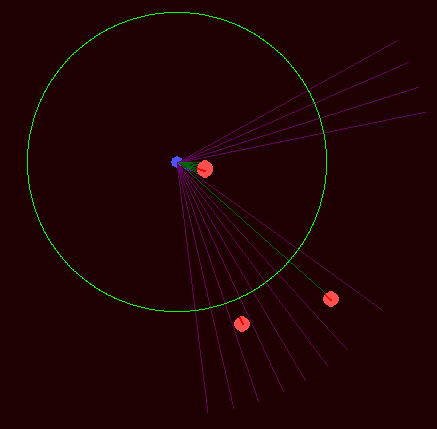

# Top Down Shooter AI

## About
Top Down Shooter game implemented in Python3 with PyGame. The goal of this game is to survive for as long as possible by shooting the enemies as they swarm around the player.

Used this game as a playground to teach ML agents to learn how to play top-down shooters, using Reinforcement Learning and Policy Gradients.

## Training
The agent played around 550 games and was saved at a checkpoint of 50 games. Below are some GIFs showing the agent at various stages of training. Note that all these models were put in the same testing environment with the same `random.seed` to avoid any biases.

## Model architecture
The model is a standated fully-connected MLP with the following architecture:
- Input: 42 neurons (explained below)
- Hidden Layer 1: 23 neurons (ReLU)
- Hidden Layer 2: 23 neurons (ReLU)
- Output: 5 neurons (softmax)

## Input explanation
The agent has a field-of-view angle of 120° and casts 20 rays in front of it that travels a distance of 250 units. The results of these raycasts is concatenated in a way where the left array contains the **normalized distances** of the objects hit by the raycast and the right array contains the **type of the object hit** (enemy, wall, nothing) by the raycast, encoded as a floating point value. 

Then the agent has an "awareness range" of 150 units. The allows the agent to be aware of the enemies around it, but it won't be able to pin-point its location without the raycasts. The awareness value is calulated by counting the number of enemies within this awareness range and dividing it by the total enemies on the map. This awareness value is then appended to the array mentioned above.

Lastly, the agents current normalized health is also appended to the array. This 20 + 20 + 1 + 1 = 42 dimensional array or vector is then fed into the agent. 

A visual example of what the agent sees:
- The green circle is the awareness range
- The various lines are the raycasts

  

## Output explanation
The agent outputs a 5-dimensional probability distribution and its action is sampled from that. The action based on the chosen indices is as follows:
- 0 - turn left
- 1 - turn right
- 2 - move forward
- 3 - move backward
- 4 - shoot
  
### Examples from various stages of training

#### Guide:
- In the interest of keeping the GIFs short, the agent's max health has been reduced to 200, which is 10% less than its training max health
- The player that the agent controls is in blue.
- The enemies are in red.
- When the player fires, the player shoots a laser in the direction it is facing
  - If the laser color is green, it means the player hit an enemy;
  - If it is gray, it means the player hit the wall (or edge of the screen);
  - If it is pink, it means the player hit nothing

**This is the agent playing the game for the first time. All its actions are basically random:**

  

---

**This is the agent after 50 games. Still its actions are basically random:**

  

---

**This is the agent after 150 games. You can see its strategy of walking backwards emerging:**

  

---

**This is the agent after 250 games. It has now learned to just walk backwards:**

  

---

**This is the agent after 350. It now walks backwards but it has learned to recognize enemies within its awareness range by quickly turning to them and shooting:**

  

---

**This is the most trained agent and has played 550 games. It's final strategy is to continuously walk backwards while shooting any enemies in its sight with precision. There is no player-enemy collision, hence by walking backwards it goes through enemies where they will then apear in front of it as it passes through them. It then uses this chance to shoot the enemy. This is not a good strategy as it get dangerously close to the enemy where the agent loses a lot of health, but nevertheless, the agent thinks this is a good stratergy and it has scored a lot of points using this strategy.**

  

## Dependencies
- Python3.7
- PyGame
- Keras
- termcolor (I really like color terminal outputs)

## Usage

All source code is located in `src`.

Run `application.py`. The various visual, game, player, and agent settings can be modified in the `settings.py` file.

To play the game yourself, set `AGENT_PLAYER` in `settings.py` to `False`. The controls are:
- WASD to move
- Left mouse to shoot
